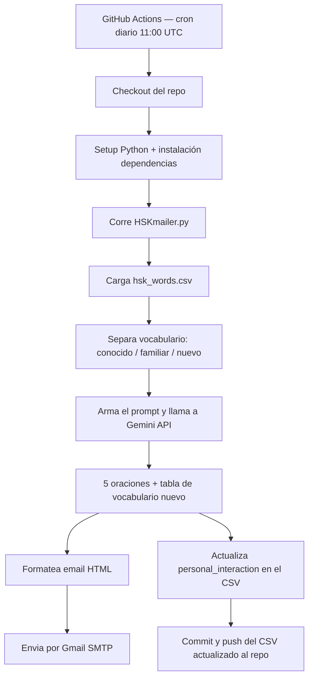

# HSK Daily Mailer

Un correo diario automatizado con oraciones en chino generadas por IA, calibradas a mi nivel de HSK usando principios de *comprehensible input*.


## Vista previa


## ¿Por qué comprehensible input?

La teoría de *comprehensible input* (input comprensible), popularizada por el lingüista Stephen Krashen, propone que aprendemos un idioma exponiéndonos a contenido que entendemos *casi* completo, con solo un poco de material nuevo mezclado adentro. Ni tan fácil que sea aburrido, ni tan difícil que sea indescifrable.

En la práctica, eso significa que la forma más eficiente de aprender no es memorizar listas de vocabulario aisladas, sino leer o escuchar historias donde la mayoría de las palabras ya las conoces, y las pocas que no conoces las puedes deducir por contexto.

Este proyecto automatiza ese entorno de aprendizaje: cada mañana genera 5 oraciones en chino donde ~65% del vocabulario ya me es familiar, ~25% lo he visto antes pero no domino, y solo ~10% es completamente nuevo — ambientadas en el género de novelas de cultivación (xianxia), que es lo que realmente leo por gusto, no ejemplos genéricos de libro de texto.

## Features

- Correo diario 100% automatizado, generado con la API de Gemini
- Calibración dinámica de vocabulario según mi historial real de exposición (columna `personal_interaction` en el CSV, de 0 a 8)
- Historias temáticas de xianxia/cultivación, no oraciones de manual de idiomas
- Formato claro: palabras nuevas marcadas con pinyin entre paréntesis, palabras conocidas sin anotación
- Email en HTML con estilo propio (tabla de vocabulario nuevo incluida)
- Tracking automático: cada palabra usada en el correo suma un punto de exposición en el CSV
- Corre en la nube vía GitHub Actions — no depende de tener el computador prendido
- Reintentos automáticos si la API falla momentáneamente

## Arquitectura



## Setup

1. Clona el repo:
   ```bash
   git clone https://github.com/karlaaluher-cyber/automated_chinese_learning.git
   cd automated_chinese_learning
   ```

2. Instala las dependencias:
   ```bash
   pip install -r requirements.txt
   ```

3. Copia `.env.example` a `.env` y rellena tus propios valores:
   ```
   client_key=
   sender_email=
   receiver_email=
   password=
   ```
   `password` es un [App Password de Gmail](https://myaccount.google.com/apppasswords), no la contraseña normal de cuenta.

4. Corre el script:
   ```bash
   python HSKmailer.py
   ```

### Para automatizarlo en la nube

El repo incluye un workflow de GitHub Actions (`.github/workflows/daily_mailer.yml`) que corre el script diariamente sin necesidad de tener el computador encendido. Solo hace falta:
1. Agregar los 4 valores del `.env` como *Repository Secrets* en Settings → Secrets and variables → Actions.
2. Activar permisos de escritura en Settings → Actions → General → Workflow permissions → "Read and write permissions" (necesario para que el workflow pueda guardar los cambios del CSV de vuelta al repo).

## Créditos

El dataset de vocabulario HSK (`hsk_words.csv`) proviene de [willfliaw/hsk-dataset](https://huggingface.co/datasets/willfliaw/hsk-dataset) en Hugging Face — no es un dataset de elaboración propia. Todo el crédito por la recopilación de palabras, niveles, pinyin y clasificación gramatical va para ese proyecto.

## Aprendizajes

Este proyecto fue extremadamente interesante de construir, en algunos aspectos mucho más simple de lo que creí que sería y en otros mucho más complejo. Esta fue mi primera vez utilizando Github y Python en un proyecto personal, y muchos de mis tropiezos tuvieron relación con descubrir herramientas que no conocía (como descubrir que el código se podía ejecutar desde  Github, pero no tener idea de cómo gestionar mis credenciales para que no quedaran públicas), no obstante, al final valió la pena seguir adelante para construir mi propia herramienta de aprendizaje de idiomas.

Creo que, para cualquiera que necesite inyectar la práctica diaria mínima para el aprendizaje de idiomas en un día ocupado, adaptar esta herramienta a sus necesidades puede al menos ayudarlos a mantener el paso con el reto que son los idiomas extranjeros.

