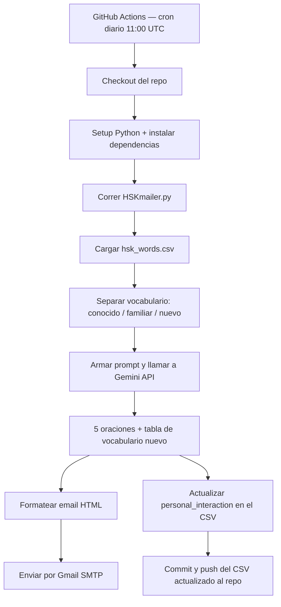

# HSK Daily Mailer

Un correo diario automatizado con oraciones en chino generadas por IA, calibradas a mi nivel de HSK usando principios de *comprehensible input*.


## Vista previa

<!-- TODO: pega aquí un screenshot del email generado, ej:  -->

## ¿Por qué comprehensible input?

La teoría de *comprehensible input* (input comprensible), popularizada por el lingüista Stephen Krashen, dice algo bastante intuitivo una vez que lo piensas: aprendemos un idioma exponiéndonos a contenido que entendemos *casi* completo, con solo un poco de material nuevo mezclado adentro. Ni tan fácil que sea aburrido, ni tan difícil que sea indescifrable.

En la práctica, eso significa que la forma más eficiente de aprender no es memorizar listas de vocabulario aisladas, sino leer o escuchar historias donde la mayoría de las palabras ya las conoces, y las pocas que no conoces las puedes deducir por contexto.

Este proyecto automatiza exactamente eso: cada mañana genera 5 oraciones en chino donde ~65% del vocabulario ya me es familiar, ~25% lo he visto antes pero no domino, y solo ~10% es completamente nuevo — ambientadas en el género de novelas de cultivación (xianxia), que es lo que realmente leo por gusto, no ejemplos genéricos de libro de texto.

## Features

- Correo diario 100% automatizado, generado con la API de Gemini
- Calibración dinámica de vocabulario según mi historial real de exposición (columna `personal_interaction` en el CSV, de 0 a 8)
- Historias temáticas de xianxia/cultivación, no oraciones de manual de idiomas
- Formato claro: palabras nuevas marcadas con pinyin entre paréntesis, palabras conocidas sin anotación
- Email en HTML con estilo propio (tabla de vocabulario nuevo incluida)
- Tracking automático: cada palabra usada en el correo suma un punto de exposición en el CSV
- Corre en la nube vía GitHub Actions — no depende de tener el computador prendido
- Reintentos automáticos si la API falla momentáneamente

## Arquitectura



## Setup

1. Clona el repo:
   ```bash
   git clone https://github.com/karlaaluher-cyber/automated_chinese_learning.git
   cd automated_chinese_learning
   ```

2. Instala las dependencias:
   ```bash
   pip install -r requirements.txt
   ```

3. Copia `.env.example` a `.env` y rellena tus propios valores:
   ```
   client_key=
   sender_email=
   receiver_email=
   password=
   ```
   `password` es un [App Password de Gmail](https://myaccount.google.com/apppasswords), no tu contraseña normal de cuenta.

4. Corre el script:
   ```bash
   python HSKmailer.py
   ```

### Para automatizarlo en la nube

El repo incluye un workflow de GitHub Actions (`.github/workflows/daily_mailer.yml`) que corre el script diariamente sin necesidad de tener el computador encendido. Solo hace falta:
1. Agregar los 4 valores del `.env` como *Repository Secrets* en Settings → Secrets and variables → Actions.
2. Activar permisos de escritura en Settings → Actions → General → Workflow permissions → "Read and write permissions" (necesario para que el workflow pueda guardar los cambios del CSV de vuelta al repo).

## Créditos

El dataset de vocabulario HSK (`hsk_words.csv`) proviene de [willfliaw/hsk-dataset](https://huggingface.co/datasets/willfliaw/hsk-dataset) en Hugging Face — no es un dataset de elaboración propia. Todo el crédito por la recopilación de palabras, niveles, pinyin y clasificación gramatical va para ese proyecto.

## Aprendizajes

Este fue mi primer proyecto llevando código desde "corre en mi compu" hasta un pipeline automatizado en la nube, y el camino tuvo más curvas de las que esperaba: variables de entorno que distinguen mayúsculas de minúsculas de forma silenciosa, permisos de escritura que GitHub restringe por defecto, y un modelo de IA que se deprecó a mitad de camino. Nada de eso salió en el tutorial que leí para empezar — salió depurando logs línea por línea hasta encontrar el mensaje exacto que explicaba qué estaba pasando.

<!-- TODO: personaliza este párrafo con tu propia reflexión -->
